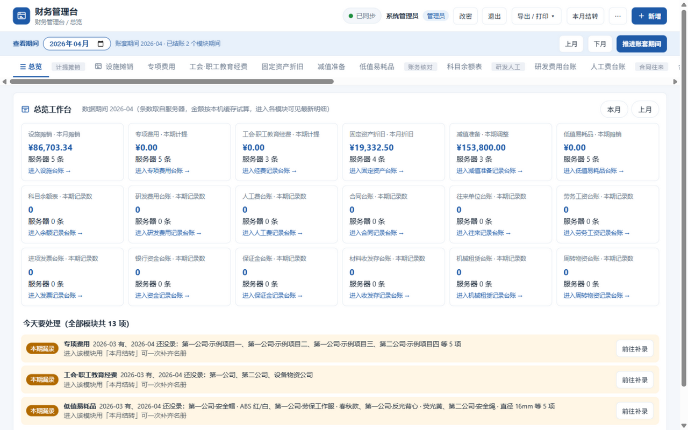
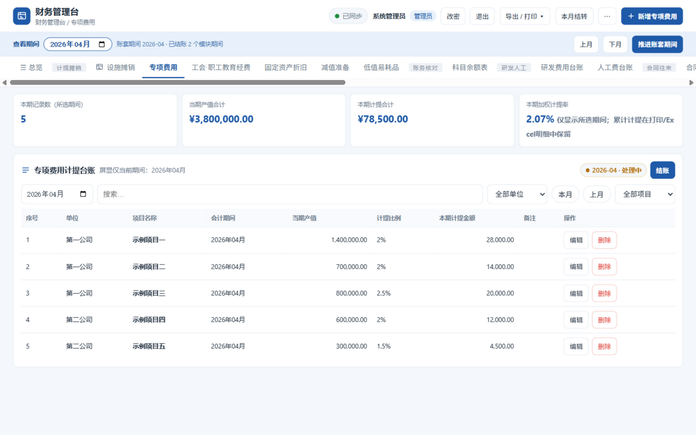
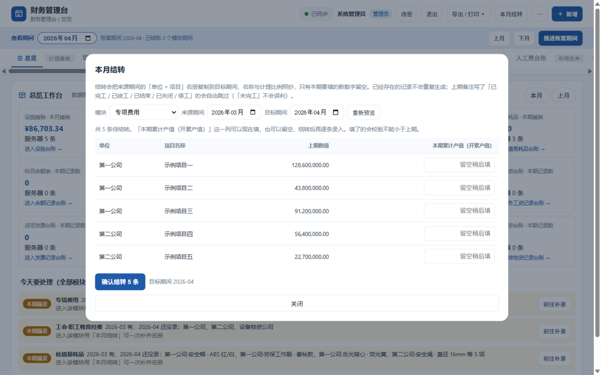

# 财务管理台 · 服务器版

把原来单文件、数据存在浏览器本地的财务台账，改造成可以部署在服务器上、多人共用一套账的 Web 系统。台账的计算口径一行没改，改的是它的运行方式，以及每月最花时间的那几步录入。

## 界面速览

| 总览工作台（漏录主动提醒） | 台账明细（自动计提） |
|---|---|
|  |  |
| **本月结转**（复制上期名册，只填新数字） | 登录（scrypt 口令哈希 + 登录限流） |
|  |  |

---

## 它解决的问题

正式核算系统里没有设施摊销、专项费用、工会经费这些台账，于是每个月都得在 Excel 里重来一遍：把上期的单位、项目名、比例粘过来，改一个新数字，重新算一遍，再手工录进正式系统。翻历史要一个个文件找，粘错一个字也没人发现。

这套系统管的就是「录进正式系统之前」的那一段：

- **本月结转**：把上一期的单位 + 项目名册整份复制到本期，名称与比例照抄，只留这期要填的新数字。不用再粘贴上期数。按月记录的模块（专项费用、工会经费、低值易耗品）都支持。
- **漏录提醒**：上期有、本期还没录的名册条目，进系统就摆在总览页上，点一下就能用结转补齐。少计提的账面上每一条都是对的，不主动提醒就只能靠月底对总数才发现。
- **单位 / 项目受控清单**：名称从清单里选，不再手打。改名会连带改写全部历史台账，计提链条不会断。
- **期初接续**：从旧账切过来时填一次「截至某期已摊/已提 X 元」，之后各期自动往下算，不用逐月补录历史。
- **Excel 粘贴导入**：从 Excel 里选一块单元格贴进来，逐行校验后批量入库。
- **历史可翻**：所有期间都在一个库里，切期间就能看，还带完整操作日志。
- **模块显隐自选**：18+ 个模块不必全摆在导航栏，每个账号可以自己隐藏用不到的（⋯ → 模块显示设置），只影响自己的界面。
- **界面自定义新建模块**：管理员不用写代码，在「⋯ → 新建模块」面板里起个名字、加几个字段（文字/数字/日期/单选），创建后立即出现在导航栏，录入、打印、Excel 导出、结账、审计全套自动可用。定义存数据库，重启不丢。

定位是「正式核算系统的前置计算与留痕工具」，不是替代它——算完之后仍然由人录入正式系统，但比手工算少了出错的机会。

---

## 改了什么

| | 原来（本地版） | 现在（服务器版） |
|---|---|---|
| 数据存放 | 每个人自己浏览器的 localStorage，换台电脑就看不到 | 服务器 SQLite 单文件库，谁登录都是同一套账 |
| 会计期间 | 各人浏览器各记一份，互不相干 | 两层：**账套期间**全局唯一（推进需结账权限），**查看期间**每人一份（想看哪个月是自己的事） |
| 结账 | 无 | 按「模块 × 期间」全局锁定，一人结账全员只读 |
| 并发修改 | 无概念 | 乐观锁：带过期版本号的修改返回 409，不会静默覆盖同事的改动 |
| 备份恢复 | 只能导出 | 导出 + **从 JSON 恢复**（先预演看清覆盖范围，覆盖前自动留底） |
| 传输 | 无压缩 | gzip：前端首屏 315 KB → 80 KB，台账 JSON 压缩比约 20 倍 |
| 访问控制 | 无，打开就能改 | 账号口令登录 + 三种角色 + 会话 |
| 数据校验 | 只在前端表单 | 服务端按字段类型与选项二次校验，绕过前端也写不进脏数据 |
| 单位 / 项目名称 | 自由文本，写法一漂移计提就翻倍 | 受控清单，下拉选择；改名连带改写历史 |
| 开新期间 | 从 Excel 粘上期数据 | 一键结转上期名册，只填新数字 |
| 建账 / 接旧账 | 逐月补录历史 | 填一次期初累计，之后自动往下算 |
| 批量录入 | 无 | Excel 粘贴导入，逐行预检 |
| 谁改了什么 | 无记录 | 完整审计日志，可按模块筛选 |
| 备份 | 手工导出 JSON | 定时热备 + 手动备份 + 整套账 JSON 导出 |
| 打印列配置 | 存本机 | 服务端共享，同事之间格式一致 |
| 代码结构 | 3696 行单文件 | 服务端模块 + 30 个前端 ES 模块，无打包器 |

前端是原生 ES 模块，`npm run build` 只做复制，不做任何文本改写；改哪个模块就只影响那个文件。

---

## 环境要求

- **Node.js 22.5 或以上**（用到内置 `node:sqlite`，不需要编译任何原生模块）
- 无第三方依赖，不需要 `npm install`
- Linux / Windows Server / Docker 都可以

检查环境：

```bash
node -v                      # 应 >= v22.5
node -e "require('node:sqlite')"   # 无报错即可
```

---

## 三种部署方式

### 方式一：Docker（最省事）

```bash
# 在项目根目录（含 server/ 的那一层）
docker compose -f server/docker-compose.yml up -d --build

# 看首次启动自动生成的管理员口令
docker compose -f server/docker-compose.yml logs | grep -A4 "首次启动"
```

默认只映射到宿主机回环 `127.0.0.1:8787`，建议前面挂 nginx 做 HTTPS。要让局域网直连，把 compose 里的端口改成 `"8787:8787"`。

账套数据在 `fin-data` 卷里，换服务器整卷搬走即可。

### 方式二：Linux + systemd

```bash
sudo bash server/deploy/install-linux.sh
```

脚本会：检查 Node 版本 → 创建 `finconsole` 系统账号 → 同步程序到 `/opt/fin-console` → 构建并校验前端 → 建好 `/var/lib/fin-console` 数据目录 → 装 systemd 单元并启动。重复执行就是升级，数据不动。

```bash
journalctl -u fin-console -f          # 看日志（首次的管理员口令在这里）
sudo systemctl restart fin-console    # 改完配置重启
sudo nano /etc/fin-console.env        # 配置文件（权限 600）
```

### 方式三：Windows Server

用管理员身份运行 `server\deploy\install-windows.bat`。装了 [nssm](https://nssm.cc/) 就注册成 Windows 服务，没装则退回计划任务开机自启。

---

## 首次使用

1. 打开 `http://服务器地址:8787`
2. 用日志里的管理员账号口令登录（默认账号 `admin`）
3. 系统强制改密，设一个至少 8 位、含字母和数字的口令
4. 进「⋯ → 账号管理」给同事开账号，选好角色，把自动生成的初始口令线下告知本人
5. **进「⋯ → 单位/项目清单」把单位和项目建起来**（见下节，这一步最好在正式录数据之前做）
6. 如果旧数据还在某台电脑的浏览器里：**用那台电脑**打开系统，进「⋯ → 导入本机旧数据」，逐模块上传

### 先建清单，再录数据

专项费用按「单位 + 项目名称」把各期串成一条链，用上期累计开累推算本期产值；工会经费按「单位」串联。名称只要差一个字——多一个空格、全角括号写成半角、"一分公司" 写成 "1分公司"——链条就断成两条，上期基数变成 0，本期产值被当成全部累计额，**计提金额凭空翻倍，而且不会有任何报错**。

所以名称必须受控：

- 清单**为空时不强制**，新装的系统可以直接开始录（否则会被自己堵在门外）
- 一旦清单里有了单位，录入界面的「单位」「项目名称」自动变成下拉框，服务端也开始拒绝清单外的名称
- 项目可以登记计提比例，录入时选中项目会自动带出比例（手改后不会被覆盖）
- 已经录了数据才想起要建清单：点「从既有台账归集」，扫描台账里出现过的名称一次性收进清单，并报出写法有差异的名称让你核对
- 迁移期确实需要临时放开：关掉「强制从清单选择」开关，操作会写进审计日志

**改名只能走「改名」按钮**：它在一个事务里同时改清单和所有历史台账，链条保持完整。新建一个正确的名字不等于改名——那会把历史留在旧名下，链条照样断。项目完工请「停用」而不是删除：停用后不再进入结转名册，历史数据完整保留。

### 两个「期间」的区别

界面顶栏有两个东西，容易混，先说清楚：

| | 查看期间 | 账套期间 |
|---|---|---|
| 是什么 | 我现在想看哪个月 | 这套账推进到哪个月 |
| 范围 | 只影响我自己的界面 | 全公司一个值 |
| 谁能改 | 任何人，包括只读账号 | 需要结账权限（管理员 / 记账员） |
| 改了会怎样 | 我的筛选、报表口径、新增记录预填的期间跟着变 | 设施摊销 / 固定资产折旧 / 减值准备的新记录归属期跟着变，从而影响结账锁住哪些数据 |
| 怎么改 | 顶栏月份选择器、「上月 / 下月」 | 顶栏「推进账套期间」按钮（先把查看期间切到目标月） |

想翻回上个月核对一下，直接改查看期间就行，不会影响正在录本月数据的同事。
只有真的要宣布「这套账进入下个月」时才推进账套期间。

结账始终是全局的：按「模块 × 期间」锁定，谁在看哪个月都不影响锁的事实。

### 每月怎么走

1. 打开系统先看**总览页的「今天要处理」**：上期有、本期还没录的名册会列在这里（标签「本期漏录」），点「前往补录」直达该模块
2. 顶栏把**查看期间**切到本月
3. 「⋯ → 本月结转」：选来源期间（默认上一期）→ 看一遍名册 → 填这期的新数字（也可以留空、之后逐条补）→ 确认
   - 上期备注写了「已完工 / 已竣工 / 已结束 / 已关闭 / 停工」的会自动跳过（「未完工」这类否定写法不会被误判）
   - 本期已经有的记录不会重复生成
   - 开累类字段（专项费用的开累产值、工会经费的工资年开累）填的数小于上期会被拒绝，那说明数字填错了
   - 当期发生数（低值易耗品的本期领用数量）不受这条限制，这月领得比上月少是正常的
4. 数字多的时候用「⋯ → Excel 粘贴导入」：从 Excel 选一块区域贴进来 → 「校验并预览」→ 看清哪几行有问题 → 只导入通过校验的行
5. 设施摊销和固定资产折旧不用按月录入，切期间就是当期数
6. 核对无误后本模块结账，再把结果录进正式核算系统

想追某一条记录被谁改过、从多少改成了多少：`GET /api/audit?recId=<记录ID>`，按时间正序返回每次改动的前后值。

### 从旧账接过来

不用逐月补录历史。设施填「期初已摊销（元）」+「期初截止期间」，固定资产填「期初已折旧（元）」+「期初截止期间」，两项必须成对填写。填了之后系统从这个基数按月往下摊，不再从启用日期重算。专项费用和工会经费对应的是「上期累计产值（元）」「期初已计提金额（元）」这类字段，只对最早一期生效。

### 角色

| 角色 | 能做什么 |
|---|---|
| 管理员 | 全部权限，含账号管理、备份、导出整套账、维护单位/项目清单 |
| 记账员 | 录入、修改、删除、结账、重开、本月结转、粘贴导入 |
| 只读 | 只能查看、打印、导出 Excel，看操作日志 |

---

## 日常运维

### 备份与恢复

服务端每 24 小时自动热备一份到 `data/backups`，保留 30 份。也可以：

- 界面：「⋯ → 数据备份 → 立即备份」
- 命令行：`node scripts/backup-now.mjs`（适合挂 cron）
- 整套账 JSON：「⋯ → 下载整套账 JSON」（含台账、受控清单、结账锁、共享设置）

**恢复方式一：从 JSON 恢复（不用停服）**

「⋯ → 数据备份 → 从 JSON 恢复」，选之前导出的 JSON 文件。流程是两步：

1. 先预演。服务端只解析不写库，把逐模块的「现有 N 条 → 恢复为 M 条」摆给你看，
   并列出受控清单、结账记录的数量，以及无法解析的内容。
2. 看清了再输入确认词 `替换全部数据` 才真正执行。服务端在覆盖前会自动热备一次现状，
   万一恢复错了还有退路。

这是**整库替换**，不是合并。合并要逐条判断「哪两条是同一笔业务」，
而这套数据的天然主键是「单位｜项目｜期间」这类业务组合键，一旦判错就会静默产生重复计提。
所以宁可要求整体覆盖，也不做半自动合并。

**恢复方式二：直接换库文件（需要停服）**

```bash
sudo systemctl stop fin-console
cd /var/lib/fin-console
cp backups/fin-20260315-030000.db fin.db
rm -f fin.db-wal fin.db-shm          # 必须删掉，否则会用旧的预写日志覆盖
sudo systemctl start fin-console
```

### 忘记口令

```bash
cd /opt/fin-console/server
sudo -u finconsole node scripts/reset-password.mjs --list          # 看有哪些账号
sudo -u finconsole node scripts/reset-password.mjs admin             # 交互式输入，不带口令参数
```

口令走交互式输入（隐藏回显、二次确认），不要写在命令行里——
写成参数会留在 shell history 和进程列表里。
自动化场景可以从管道读：`echo '新口令Ab123456' | node scripts/reset-password.mjs admin`。

### 改了前端之后

```bash
cd server
npm run build && npm run verify
sudo systemctl restart fin-console   # Docker 则 up -d --build
```
浏览器刷新即生效（HTML 不缓存，静态资源用 ETag 校验）。前端源码在 `frontend/`，`public/` 是构建产物，别直接改 `public/`——下次构建会被覆盖。

---

## 安全说明

> 本仓库中的全部示例与种子数据（单位、项目、金额、人员名）均为通用占位内容，不对应任何真实单位、项目或个人。

已经做了的：口令 scrypt 加盐哈希、HttpOnly + SameSite=Strict 会话 Cookie、跨站写请求拦截、CSP 响应头、静态文件路径穿越防护、服务端字段白名单校验、非 root 运行、systemd 文件系统加固，以及：

- **首登强制改口令是服务端强制的**。未改初始口令前只放行改口令与查看自身信息，写台账和导出都会被拒（403 `must_change_password`）。初始口令是打印在控制台、写在部署脚本里的，暴露面比设计意图大。
- **登录限流按三个维度分别计数**：`用户名@IP`、纯 IP、纯用户名。只按第一个维度计数的话，换个用户名计数就重置（账号枚举无效化），开了 `FIN_TRUST_PROXY` 后伪造 `X-Forwarded-For` 也能无限重试。
- **最后一个管理员不能自我降级或被停用**。管理权限一旦归零，`/api/users` 全部 403，再也改不回来——`reset-password` 只能改口令不能改角色。
- **表格渲染全部 HTML 转义**。备注、名称一类文本字段里的 `` 不会被当作 HTML 执行。
- **健康检查默认不含业务数据**。`/api/health` 无需登录（给探针用），端口一旦误暴露就不该把各模块记录数交出去。

**还需要你决定的：**

1. **默认只监听 `127.0.0.1`**。改成 `0.0.0.0` 让局域网访问前，先确认防火墙只放行需要的网段。
2. **强烈建议挂 HTTPS**。裸 HTTP 下口令和财务数据在网络上是明文。参考 `deploy/nginx-fin-console.conf`，配好后把 `FIN_COOKIE_SECURE=1`、`FIN_TRUST_PROXY=1` 打开。
3. **不要直接暴露到公网**。真需要外网办公，走 VPN 或在反向代理上做 IP 白名单（示例配置里已经写了内网段限制）。

---

## 配置项

环境变量优先，其次 `server/config.json`（可从 `config.example.json` 复制）。

| 变量 | 默认 | 说明 |
|---|---|---|
| `FIN_HOST` | `127.0.0.1` | 监听地址；局域网访问改 `0.0.0.0` |
| `FIN_PORT` | `8787` | 端口 |
| `FIN_DATA_DIR` | `server/data` | 数据库与备份目录 |
| `FIN_ORG_NAME` | 空 | 打印表头「编制单位」缺省值 |
| `FIN_ADMIN_USER` | `admin` | 首启动创建的管理员账号 |
| `FIN_ADMIN_PASSWORD` | 空 | 留空则自动生成并打印到日志 |
| `FIN_SESSION_HOURS` | `12` | 会话有效期（会滑动续期） |
| `FIN_COOKIE_SECURE` | `0` | HTTPS 下设 `1` |
| `FIN_TRUST_PROXY` | `0` | 反代之后设 `1`，日志才记真实 IP |
| `FIN_LOGIN_MAX_ATTEMPTS` | `8` | 窗口内失败上限 |
| `FIN_LOGIN_WINDOW_MINUTES` | `15` | 限流窗口 |
| `FIN_BACKUP_INTERVAL_HOURS` | `24` | 自动备份间隔，`0` 关闭 |
| `FIN_BACKUP_KEEP` | `30` | 备份保留份数 |
| `FIN_MAX_ROWS` | `20000` | 单模块单次返回上限 |
| `FIN_COMPRESS` | `1` | gzip 压缩。前面已有 nginx 做压缩时可设 `0` 免得压两遍 |
| `FIN_HEALTH_DETAIL` | `0` | `/api/health` 是否对匿名请求返回各模块记录数。默认关闭，避免端口误暴露时泄露账套规模 |

---

## 自检

```bash
cd server
npm run check-esm     # 模块图校验：import/export 闭合、无重复声明、无漏引用
npm run verify        # 上一步 + 构建产物结构校验
npm run test:frontend # 前端核心逻辑自检（17 项，不需要浏览器）
npm test              # 接口端到端自检（128 项，临时库跑完即删）
npm run test:browser  # 无头浏览器真实点击自检（42 项，需装 Edge/Chrome）
npm run test:all      # 全跑（没装浏览器时自动跳过那一项，不算失败）
```

另有一个**结转跨年实测脚本** `scripts/carry-crossyear-test.mjs`：先 `npm run demo` 起演示实例，
再 `node scripts/carry-crossyear-test.mjs`。它会从 3 月起连续结转 11 期直到跨过 2026-12 → 2027-01
年界，每期填充累计产值、逐条断言「累计产值落库、当期产值 = 本期累计 − 上期累计、计提金额按比例
精确到分、结账锁生效、开累单调递增、跨年链条连续」，12 期共 5 个项目 60 条记录全量核对。
```

`test:frontend` 是给 period.js 一个内存版 localStorage 直接跑真实模块，覆盖两层期间的
独立性与回落、期间合法性、结账按哪个期间判锁、开累回退校验取哪一期做基数。
之所以单独有它：`test:browser` 依赖本机装了 Edge/Chrome，在服务器和 CI 上通常直接跳过，
只靠它的话前端逻辑等于没有自动化守护。

浏览器自检会真的打开页面走完整流程：登录 → 强制改密 → 切模块 → 填表新增 → 校验摊销金额 → 结账转只读 → 验证服务端拒绝写入 → 重开 → 打印组装 → Excel 导出 → 管理面板 → 建单位/项目清单 → 确认录入框变成下拉且自动带出比例 → 录上期数据 → 本月结转 → 核对结转后的当期产值与计提额 → 粘贴导入预检与写入 → 期初接续的成对校验与摊销口径 → 数据取不全时拒绝计算与导出 → 总览页漏录提醒 → 切只读角色验证写入口全部隐藏，以及 v1.2.0 的：直调 API 写负数被拒、删除链式记录前确认框列出重算影响、科目余额表借贷不平衡与银行资金勾稽不符进入「勾稽异常」提醒，并断言全程控制台无报错。

接口自检额外覆盖：清单为空时放行、名称规范化（全角括号/多余空白）、清单外名称被拒、单位与项目改名连带改写历史、写法漂移检测、结转的重复与倒挂防护、已结账期间禁止结转与导入、粘贴导入逐行预检不写库、管理员迁移显式跳过校验。

### 数据完整性防线（不能算错，宁可不算）

台账的价值在于金额可信，所以「拿不全数据」必须表现为拒绝计算，而不是算出一个看起来正常的数字。

服务端按 `(期间, 创建时间)` 升序返回记录，`limit` 砍掉的是**最新**的那一段。而
levy / union 的计提是链式的（本期 = 本期累计 − 上期累计），链条尾部被截掉之后仍然
算得出一个自洽但错误的金额，界面上没有任何迹象表明它是错的。这类故障不报错、只错钱。

因此：

- `/api/modules/:mod/records` 的 `total` 是**符合条件的真实总数**，另有 `returned` 与
  `truncated`。（此前 `total` 返回的是截断后的长度，前端永远看到 `total === results.length`，
  根本无从判断数据不全。）
- 前端一次请求的上限 `MAX_ROWS` 必须与服务端 `FIN_MAX_ROWS` 一致，不能自己写一个更小的数。
- 一旦 `truncated`，台账页清空表格与合计、把原因和处置办法写在页面上；打印与
  Excel/JSON 导出一并挡住——导出的报表会被打印签字归档，比屏幕上显示错数字更危险。

对应回归用例：截断时 `total` 报真实总数并标记 `truncated`、未截断时为 `false`、
截断砍掉的确实是最新期间、`engine.js` 不得把 `pageSize` 写死、`menu.js` 必须挡住全部
导出动作，以及浏览器里真实复现一次截断并断言界面不显示任何金额、恢复后重新可用。

以及这一轮修复对应的回归用例：未改初始口令时业务操作被拒且改密后恢复、只读账号不能推进账套期间
但能改自己的查看期间、不存在的年月与日期（`2026-13` / `2026-02-31`）被拒、乐观锁冲突返回 409
且先提交的修改不被覆盖、gzip 压缩与 `Vary` 响应头、畸形 Cookie 与畸形 URL 编码不再 500、
匿名健康检查不泄露记录数、最后一个管理员不能自我降级或停用、换用户名不能绕过登录限流、
导出包含受控清单、备份恢复的预演与整库替换、低值易耗品结转与「当期发生数不受开累校验限制」、
漏录提醒与结转口径一致、按 `recId` 追单条记录的修改历史。

### 业务校验的服务端兜底（v1.2.0）

录入表单拦得住的规则，曾经只在浏览器里存在：REST API、粘贴导入、脚本迁移全部绕过——
实测负数原值、不成对的期初接续、比上期还小的开累都能落库，然后被摊销/计提算法算成
看似自洽的错误金额。现在 `lib/business.js` 在服务端对**每一次写入**（新增 / 修改 / 批量导入）
再兜一层：

- 金额、数量、比例不得为负；比例不超过 100；原值/数量/科目余额必须为正
- 设施 / 固定资产的「期初已摊销（已折旧）」与「期初截止期间」必须成对，
  金额不能超过应摊总额，期间不能早于启用月
- levy / union 的开累字段对前后期间单调：不小于上期，回填历史期间也不能大于后期
- 同一单位（+项目）同一期间不重复录入（与界面 dupKey 同一套键），批量导入逐行拦截

两条边界：**校验只针对本次提交的字段**——存量数据里的历史错误不会把「改备注」这类无关修改
锁死；管理员迁移通道（`allowNewNames`）同时跳过清单与业务校验并写审计，历史脏数据先进账、
再走「从既有台账归集」与人工核对。

对应回归用例：负数金额经单条与批量导入均被拒、比例越界被拒、期初不成对与超应摊总额被拒、
开累回退与回填超后期被拒、重复新增与批内重复被逐行跳过、改备注不受存量数据影响、
预检与正式导入报同一套业务错误、「未完工 / 尚未完工」不再被结转误判为已完工，
以及浏览器里直调 API 同样被拒。

### 结账前的最后一道检查（v1.2.0）

可结转模块（专项费用、工会经费、低值易耗品）点「结账」时，若目标期间还有上期名册没录，
确认框会直接列出条数与名单——这些项目本期将没有计提记录，而结账后漏录提醒也不再出现，
这是把它们找回来的最后机会。检查接口失败（离线、重启窗口）不拦结账，退回普通确认框。

### 链式记录删除影响预览（v1.2.0）

删除专项费用 / 工会经费的记录前，确认框按剩余记录重算一遍链条，列出后续每个期间的
本期计提「从多少变成多少」——删掉链首时整段开累会并进次月，计提额可能翻几十倍，
把数字摆在确认框里比一句泛泛的警告有用得多。

### 勾稽提醒（v1.2.0）

一批「行内勾稽关系是死的」的模块加了自动核对，异常以「勾稽异常」标签进入模块页提醒区
与总览页「今天要处理」：

- 科目余额表：按期间汇总期初 / 本期发生 / 期末三段，借方合计必须等于贷方合计（试算平衡）
- 银行资金：期初 + 本期收入 − 本期支出 = 期末余额
- 材料收发存：期初结存 + 本期入库 − 本期出库 = 期末结存
- 保证金：缴纳金额 − 已退还 = 余额
- 往来单位：按「余额方向」判断——借方 期初+借−贷=期末，贷方 期初+贷−借=期末
  （「平」与未填方向无法判断，跳过不打扰）

勾稽关系相同的模块共用 `generic.js` 的 `flowCheckAttention` 工厂；同类问题超过 6 条时
只摆前几条，其余并成一条汇总，避免提醒区被刷屏。

---

## 先看效果

不想先配部署，只想看看长什么样、好不好用：

```bash
cd server
npm run build
npm run demo            # 默认 8787 端口，可加端口号：npm run demo 8790
```

它会起一个**独立的演示账套**（数据在 `server/data-demo/`，和正式账套完全隔离），预置 3 个单位、5 个项目、3 月已录完并结账的专项费用与工会经费、含期初接续的设施与固定资产，然后把期间切到 4 月留空。启动后终端会打印地址和账号口令。

按打印出来的顺序点一遍，就能看到这套系统到底省掉了哪些手工活。想重来：`npm run demo -- --reset`，或直接删掉 `server/data-demo/`。

顺手留档：`node scripts/screenshot.mjs http://127.0.0.1:8790 admin 口令` 会用无头浏览器把主要界面截 14 张图到 `server/.shots/`。

---

## 目录结构

```
server/
  server.js                 入口：HTTP、引导管理员、定时任务、优雅退出
  lib/
    config.js               配置解析（环境变量 > config.json > 默认值）
    db.js                   SQLite 建表与事务
    schema.js               全部模块的权威字段定义与校验（新增模块从这里起）
    business.js             业务校验兜底：非负、期初成对、开累单调、业务主键去重
    auth.js                 口令哈希、会话、角色、登录限流
    store.js                记录 CRUD、结账锁、共享设置、审计
    masterdata.js           单位/项目受控清单：增改、改名连带重写、归集、校验
    carry.js                本月结转：预览上期名册、批量写入本期；漏录检查
    routes.js               REST API 路由
    http.js                 请求体、Cookie、静态文件、安全响应头
    backup.js               热备份与保留策略
  frontend/                 前端源码（改这里）
    index.html              外壳：登录层 + 台账骨架
    styles/app.css
    bridge.js               登录界面 + 把 database/localStorage 接到服务端
    admin.js                操作日志、账号管理、备份、旧数据迁移面板
    app/                    台账逻辑，30 个 ES 模块
      main.js               入口：绑定事件、按注册表初始化各模块
      core/                 env(环境与清单) state dom format text
      modules/              facility levy union asset baddebt lvc + registry + generic(通用模块工厂)
      features/             carry(结转) paste(粘贴导入) masterdata(清单面板)
      engine.js             表格渲染、CRUD、筛选、弹窗
      period.js periodchips.js switch.js menu.js overview.js
      print*.js xls*.js printconfig.js formkit.js clear.js
  scripts/
    build-frontend.mjs      复制 frontend/ 到 public/（不改写内容）
    check-esm.mjs           模块图校验
    verify-build.mjs        产物结构校验
    smoke-test.mjs          接口端到端自检
    browser-test.mjs        无头浏览器自检
    demo.mjs                起演示实例并预置示例数据
    new-module.mjs          新增模块脚手架（见「后续增加模块」）
    screenshot.mjs          给运行中的实例批量截图
    reset-password.mjs      命令行重置口令
    backup-now.mjs          手动备份
  deploy/
    fin-console.service     systemd 单元（含安全加固）
    fin-console.env         环境配置模板
    nginx-fin-console.conf  HTTPS 反向代理示例
    install-linux.sh        Linux 一键安装/升级
    install-windows.bat     Windows 安装
  public/                   构建产物（勿手改）
  data/                     运行时数据（勿提交版本库）
```

---

## API 速查

所有接口都需要登录（Cookie 会话），写操作要求同源。

| 方法 | 路径 | 说明 |
|---|---|---|
| POST | `/api/login` `/api/logout` `/api/password` | 登录、退出、改密 |
| GET | `/api/me` | 当前身份、权限、期间、结账状态、单位/项目清单 |
| GET | `/api/schema` `/api/modules/:mod/schema` | 字段定义 |
| GET/POST/DELETE | `/api/modules/:mod/records` | 列表 / 新增 / 清空 |
| GET/PATCH/DELETE | `/api/modules/:mod/records/:id` | 单条读写删 |
| POST | `/api/modules/:mod/import` | 批量导入（管理员可带 `allowNewNames` 跳过清单与业务校验，用于历史数据迁移） |
| POST | `/api/modules/:mod/import/check` | 逐行预检，只校验不写库 |
| GET/POST | `/api/master/units` | 单位清单 / 新增（管理员） |
| PATCH/DELETE | `/api/master/units/:name` | 改名或改属性 / 停用（管理员） |
| GET/POST | `/api/master/projects` | 项目清单 / 新增（管理员） |
| PATCH/DELETE | `/api/master/projects/:id` | 改名、改比例 / 停用（管理员） |
| POST | `/api/master/seed` | 从既有台账归集清单（管理员） |
| POST | `/api/master/strict` | 开关「强制从清单选择」（管理员） |
| GET/POST | `/api/carry/:mod` | 结转预览 / 执行结转（按月记录的模块：levy、union、lvc） |
| GET/POST | `/api/period` | 读取 / 推进**账套期间**（POST 需结账权限，影响全员） |
| POST/DELETE | `/api/view-period` | 设置 / 取消**个人查看期间**（任何账号都能改自己的，不影响别人） |
| GET/POST | `/api/closures` | 结账状态 / 结账与重开 |
| GET/POST | `/api/settings` | 共享设置（单位名、打印列） |
| GET | `/api/overview` | 各模块汇总（条数/单位数/期间分布）+ 漏录名单；`?detail=1` 才返回全部明细 |
| GET | `/api/audit` | 操作日志。`?module=` 按模块筛，`?recId=` 追单条记录的完整修改历史（按时间正序，含每次改动的前后值） |
| GET/POST | `/api/backup` | 备份列表 / 触发备份（管理员） |
| GET | `/api/export` | 整套账 JSON，含受控清单与结账锁（管理员） |
| POST | `/api/import` | 从备份 JSON 恢复整套账。默认预演；正式执行需带 `confirm:"替换全部数据"`（管理员） |
| GET/POST/PATCH/DELETE | `/api/users` `/api/users/:name` | 账号管理（管理员） |
| POST | `/api/prefs/modules` | 模块显隐自选：保存当前账号要隐藏的模块 key 列表（只影响自己） |
| POST | `/api/modules-custom` | 新建界面自定义模块：`{name, monthly, fields:[{name,type,required,options}]}`，创建即生效（管理员） |
| DELETE | `/api/modules-custom/:key` | 删除自定义模块，仅限没有任何台账数据的空模块（管理员） |
| GET | `/api/health` | 健康检查，无需登录。默认不含业务数据；管理员或开启 `FIN_HEALTH_DETAIL` 后 `?detail=1` 可看记录数 |

模块标识可用 `facility` `levy` `union` `asset` `baddebt` `lvc`，也接受旧版的 dbId。界面自定义的模块 key 以 `custom_` 开头，接口形状完全一样。
新增的模块用它自己的 key，接口形状完全一样，不需要为它加任何路由。

---

## 后续增加模块

一条命令。写一份字段声明，跑脚手架，跑测试。

```bash
npm run new-module -- --example > 资金管理.json   # 打一份声明模板
# 用记事本改 key / name / fields（改成你要的字段）
npm run new-module -- 资金管理.json               # 生成
npm run build && npm run verify && npm run test:all
npm start                                        # 打开浏览器点新页签
```

声明长这样，`fields` 里的中文名就是将来在界面上、Excel 里、数据库里看到的名字：

```json
{
  "key": "cash",
  "name": "资金管理",
  "entity": "资金记录",
  "periodField": "会计期间",
  "sortField": "会计期间",
  "fields": [
    { "name": "单位", "type": "text", "required": true },
    { "name": "会计期间", "type": "date", "required": true },
    { "name": "款项性质", "type": "select", "options": ["项目款", "保证金"] },
    { "name": "收款金额(元)", "type": "number" },
    { "name": "备注", "type": "text" }
  ]
}
```

字段类型只有四种：`text` `number` `date` `select`（`select` 要给 `options`）。
`periodField` 填了就是按月记录的台账（屏显只看当期，可按期结账）；填 `null`
就是常设台账（像固定资产那样一直挂着，本期数按账套期间算）。

脚手架会改四处：`lib/schema.js`（服务端字段定义）、
`frontend/app/modules/<key>.js`（新文件）、
`frontend/app/modules/registry.js`（注册表）、`frontend/index.html`（页签，
如果导航里已有同名的「规划中」占位页签，会替换掉它而不是并排再加一个）。

生成出来的模块**开箱即用**：录入表单、列表、筛选、合计、打印、Excel 导出、
结账只读、受控清单联动、操作日志筛选，全都在。剩下的只有算法。

### 要加计提口径怎么办

打开 `frontend/app/modules/<key>.js`，覆盖对应的方法（文件头注释里写了）：

| 想改什么 | 覆盖哪个 |
|---|---|
| 每行独立的算法（比例、税额、账面净值） | `rowCalc(r, pe)` |
| 需要看上期数据的算法（链式计提、开累、差额） | `calcAll(rows)` |
| 列顺序、表头、要不要显示某列 | `columns` |
| 正式报表格式（合并表头、分组小计、盖章栏） | `buildPrint(rows, calcs)` |
| 统计卡片显示什么 | `stats(rows)` |
| 到期提醒 | `attention(rows, calcs)` |

抄现成的最快：口径像折旧摊销的抄 `asset.js`，
像按进度链式计提的抄 `levy.js`，简单登记的抄 `lvc.js`。

### 想让新模块也支持「本月结转」

脚手架生成的模块默认不进结转名册。如果它是按月记录的（声明了 `periodField`），
在 `lib/carry.js` 的 `CARRY_MODULES` 里加一条即可，前端下拉和总览页的漏录提醒
都会自动跟上（它们都从服务端的这份声明推导，不需要另外改前端）：

```js
mykey: {
  identity: ['单位', '资产名称'],      // 哪几个字段唯一确定「同一个东西」
  carry: ['单位', '资产名称', '单价(元)'], // 照抄上期的字段
  input: '数量',                       // 每期要填的新数字（结转后留空）
  inputLabel: '本期领用数量',
  reference: '数量',                   // 显示上期值做参考
  cumulative: false,                   // 见下
},
```

`cumulative` 必须想清楚：`true` 表示这个字段是**累计口径**（开累产值、工资年开累），
本期值小于上期就是填错了，会被拒绝；`false` 表示**当期发生数**（本期领用数量），
这月比上月少是正常的，不能拦。填反了会把正常录入拦下来，或者放过真正的错数。

### 两条不能破的规矩

1. **字段名一个字都不能改。** `lib/schema.js` 里的名字就是数据库里的名字，
   也是前端 `r['字段名']` 取值用的名字。改名等于换字段，历史数据取不到。
2. **`key` 定了就不能改。** 它是 `records.module` 列的值，改了等于历史数据全部失联。

### 不用改的地方（以前要改，现在不用了）

`admin.js`、`printconfig.js` 的模块清单已改为从服务端 schema 与注册表读取；
结转面板的模块下拉从 `/api/me` 的 `carryModules` 读取；
没写专属报表规格的模块，打印和 Excel 会按 `columns` 自动生成；
`lib/routes.js`、`lib/store.js` 本来就遍历 `MODULE_KEYS`。
所以这些文件加模块时都不需要动——这也是以前最容易漏、漏了还不报错的地方。

### 不想动代码

告诉小台你要什么模块、要哪些字段就行。字段清单（中文名 + 是文字/数字/日期/下拉）
给全了，剩下的都是机械劳动。

